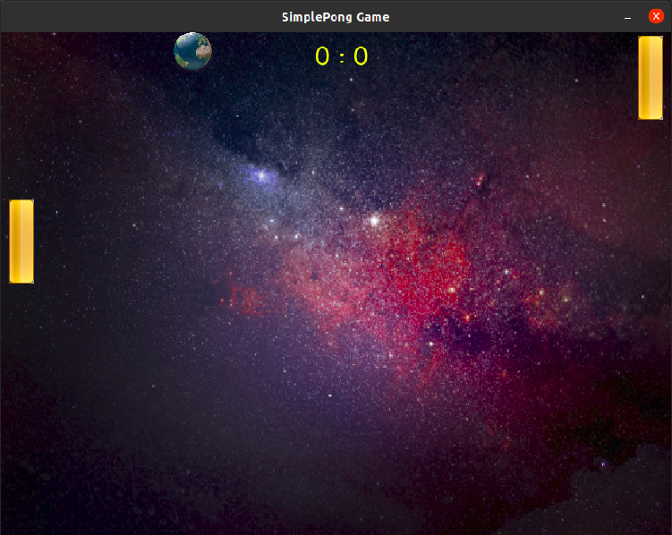

# Simple Pong Game
This is a very simple C++ based 2d pong game. It is very simple, and its only purpose is to learn the basics of game development for desktop.

# Images


# Installs
The game is only for Linux platform. You can install it by running a terminal and just type in:
```
make install
```
And to run it:
```
make run
```

# Commands
The commands to move the left pad are up and down arrow keys, and if you would like to pause the game just press 'P' button. Then press 'P' button again to resume it.

# License
This software is completely free; see <a href="LICENSE" >GNU General Public License.</a>